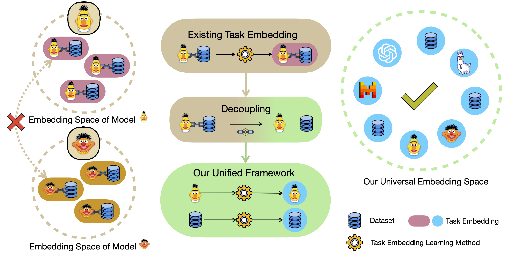
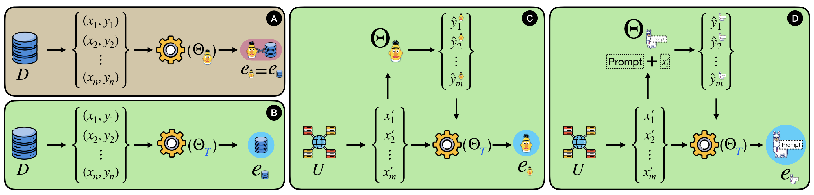

# Towards Unified Task Embeddings Across Multiple Models: Bridging the Gap for Prompt-Based Large Language Models and Beyond

Code for the paper: 
["Towards Unified Task Embeddings Across Multiple Models: Bridging the Gap for Prompt-Based Large Language Models and Beyond"](https://arxiv.org/abs/2402.14522)

## Introduction

> Task embedding, a meta-learning technique that captures task-specific information, has become prevalent, especially in areas such as multi-task learning, model editing, and interpretability. However, it faces challenges with the emergence of prompt-guided Large Language Models (LLMs) operating in a gradientfree manner. Existing task embedding methods rely on fine-tuned, task-specific language models, which hinders the adaptability of task embeddings across diverse models, especially prompt-based LLMs. To unleash the power of task embedding in the era of LLMs, we propose a framework for unified task embeddings (FUTE), harmonizing task embeddings from various models, including smaller language models and LLMs with varied prompts, within a single vector space. Such uniformity enables the comparison and analysis of similarities amongst different models, extending the scope and utility of existing task embedding methods in addressing multi-model scenarios, whilst maintaining their performance to be comparable to architecture-specific methods.





## Dependency

```
Python
torch
transformers
numpy
tqdm
sklearn
scipy
datasets
evaluate
```

Please put you llama2 token at `./llm_inference/configs/llama_token.key`

Our framework, FUTE, focuses on extending the existing methods. Please refer to [TaskEmb](https://github.com/tuvuumass/task-transferability) and [TuPaTe](https://github.com/JetRunner/TuPaTE) for more details about the task embedding methods.

## Usage

The code follows the structure of [TaskEmb](https://github.com/tuvuumass/task-transferability), and contains six entries:

`run_cr_train.py` and `run_qa_train.py`: Fine-tune of CR and QA dataset.

`run_task_emb.py`: Extract task embedding, including using baselines and FUTE+baselines.

`run_llm_inference.py`: Get inference results from LLM.

`run_prompt_selection_baselines.py`: The prompt selection baselines implementation.

`run_llm_inference_for_te.py`: A helper code for the task embedding of LLM.

The followings are examples to run them.

### Fine-tune

#### CR

To fine-tune BERT on a CR dataset WNLI and save the model checkpoint to `./result/wnli_bert_checkpoint/` and score to `./result/wnli_bert_score.json`:
```bash
python python run_cr_train.py \
    --to_train_dataset=wnli \
    --model_save_path=./result/wnli_bert_checkpoint \
    --score_save_path=./result/wnli_bert_score \
    --lm_model_name=bert-base-uncased \
    --gradient_accumulation_steps=4 
```
The model will be saved with both huggingface function and pytorch default function.

Supported CR dataset: `wnli,mrpc,cola,stsb,rte,boolq,sst2,scitail,qnli,snli,qqp,mnli,financial_phrasebank,medqa,medical_questions_pairs`. `boolq` is a QA dataset but please call `run_cr_train.py` to fine-tune it.

#### QA

To fine-tune bert on a QA dataset CQ and save the model checkpoint to `./result/cq_bert_checkpoint/` and score to `./result/cq_bert_score.json`:
```bash
python python run_qa_train.py \
    --to_train_dataset=cq \
    --model_save_path=./result/cq_bert_checkpoint \
    --score_save_path=./result/cq_bert_score \
    --lm_model_name=bert-base-uncased \
    --gradient_accumulation_steps=4 
```
The model will be saved with both huggingface function and pytorch default function.

Supported QA dataset: `cq,comqa,wikihop,duorcp,duorcs,newsqa,drop,hotpotqa,squad,squad_v2`.

### Task-Transfer Fine-tune

#### CR

To further fine-tune a BERT model, which was fine-tuned with WNLI, on another dataset MRPC and save the model checkpoint to `./result/wnli_mrpc_bert_checkpoint/` and score to `./result/wnli_mrpc_bert_score.json`:
```bash
python python run_cr_train.py \
    --to_train_dataset=mrpc \
    --model_save_path=./result/wnli_mrpc_bert_checkpoint \
    --score_save_path=./result/wnli_mrpc_bert_score \
    --load_path=./result/wnli_bert_checkpoint \
    --lm_model_name=bert-base-uncased \
    --gradient_accumulation_steps=4  
```

#### QA

To further fine-tune a BERT model, which was fine-tuned with CQ, on another dataset ComQA and save the model checkpoint to `./result/cq_comq_bert_checkpoint/` and score to `./result/cq_comq_bert_score.json`:
```bash
python run_qa_train.py \
    --to_train_dataset=comqa \
    --model_save_path=./result/cq_comqa_bert_checkpoint \
    --score_save_path=./result/cq_comqa_bert_score \
    --load_path=./result/cq_bert_checkpoint \
    --lm_model_name=bert-base-uncased \
    --gradient_accumulation_steps=4 
```

#### QA -> CR

To further fine-tune a BERT model, which was fine-tuned with CQ (QA), on another dataset MRPC (CR) and save the model checkpoint to `./result/cq_mrpc_bert_checkpoint/` and score to `./result/cq_mrpc_bert_score.json`:
```bash
python python run_cr_train.py \
    --to_train_dataset=mrpc \
    --model_save_path=./result/cq_mrpc_bert_checkpoint \
    --score_save_path=./result/cq_mrpc_bert_score \
    --load_path=./result/cq_bert_checkpoint \
    --lm_model_name=bert-base-uncased \
    --gradient_accumulation_steps=4 
```
The selection of `run_cr_train.py` and `run_qa_train.py` depends on the current task of the dataset that is going to be fine-tuned on.

### Task Embedding from Baselines

To get task embedding using original prefix method (baseline) with t5-base on a CR dataset WNLI and save the task embedding to `./result/wnli_task_emb.npy`:
```bash
python run_task_emb.py \
    --task_type=cr \
    --input_type=data \
    --task_emb_type=prefix \
    --task_emb_model_lm_name=t5-base \
    --lm_model_name=t5-base \
    --is_baseline=True \
    --to_train_dataset=wnli \
    --gradient_accumulation_steps=2 \
    --save_path=./result/wnli_task_emb.npy
```
`--task_emb_type` supports `prefix` and `fim`

### Dataset Task Embedding

To get dataset task embedding of a CR dataset WNLI using prefix method with t5-base and save the dataset task embedding to `./result/wnli_task_emb.npy`:
```bash
python run_task_emb.py \
    --task_type=cr \
    --input_type=data \
    --task_emb_type=prefix \
    --task_emb_model_lm_name=t5-base \
    --lm_model_name=t5-base \
    --is_baseline=False \
    --to_train_dataset=wnli \
    --gradient_accumulation_steps=2 \
    --save_path=./result/wnli_task_emb.npy
```
`--task_emb_type` supports `prefix` and `fim`

### Model Task Embedding for Language Model

To get model task embedding of a BERT fine-tuned on a CR dataset WNLI using prefix method with t5-base and save the model task embedding to `./result/wnli_bert_task_emb.npy`:
```bash
python run_task_emb.py \
    --save_path=./result/wnli_bert_task_emb.npy \
    --load_path=./result/wnli_bert_checkpoint \
    --task_type=cr \
    --input_type=model \
    --task_emb_type=prefix \
    --lm_model_name=bert-base-uncased \
    --task_emb_model_lm_name=t5-base \
    --gradient_accumulation_steps=16 \
    --is_baseline=False \
    --max_data_for_task_emb_train=1000 \
    --model_te_read_num_processes=10 \
    --to_train_dataset=wnli
```
`--task_emb_type` supports `prefix` and `fim`

Setting `--task_type=cr` and `--to_train_dataset=wnli` is to ensure that the model can be loaded correctly (e.g., to load the number of class).

`--model_te_read_num_processes` sets the number of processor to process the unsupervised dataset.

### LLM Inference

To do inference with 8bit llama2-13b-chat on dataset CB using prompt #0 with randomly sampled 1000 data (in case the dataset contain more than 1000 data), and save the score result to `./result/cb_llama13b_b8_p0.json`:
```bash
python run_llm_inference.py \
    --save_path=./result/cb_llama13b_b8_p0 \
    --model=llama-13b \
    --dataset_name=cb \
    --prompt_number=0 \
    --bit=8 
```

Support SA datasets: `sst2,imdb,rotten_tomatoes`.

Support NLI datasets: `cb,anli,wanli`.

### LLM Prompt Selection Baseline

To get the rank result of prompt selection baselines for prompt #0-#12 (a total of 13) with llama2-13b-chat and save the result to `./result/prompt_selection_score.json`
```bash
python run_prompt_selection_baselines.py \
--paths=./result/cb_llama13b_b8_p0.json,\
./result/cb_llama13b_b8_p1.json,\
./result/cb_llama13b_b8_p2.json,\
./result/cb_llama13b_b8_p3.json,\
./result/cb_llama13b_b8_p4.json,\
./result/cb_llama13b_b8_p5.json,\
./result/cb_llama13b_b8_p6.json,\
./result/cb_llama13b_b8_p7.json,\
./result/cb_llama13b_b8_p8.json,\
./result/cb_llama13b_b8_p9.json,\
./result/cb_llama13b_b8_p10.json,\
./result/cb_llama13b_b8_p11.json,\
./result/cb_llama13b_b8_p12.json \
--save_path=./result/prompt_selection_score
```
Use `,` in `--paths` to separate the paths from different inference results. The used results should from the same LLM and the same dataset but with different prompt.

This function does not do inference but only give prompt rank score of baselines based on the inference results.

### Model Task Embedding for Large Language Model

The process of model task embedding for LLM is different from LM.

For LM, the model is small and is loaded into GPU when learning its model task embedding.

For LLM, the model is too big. The code will first generate `x'` and save them to disk. Then infer LLM to get `y'` and save to disk. Finally, the task embedding learning method read both `x'` and `y'` from disk to learn model task embedding for LLM.

Here are detailed steps:

#### Unsupervised Data Generation

To generate and save `x'` for SA task at `./result/sa_un_data.jsonl`:
```bash
python run_task_emb.py \
    --save_path=./result/sa_un_data.jsonl \
    --task_type=sa \
    --input_type=model \
    --task_emb_type=prefix \
    --lm_model_name=none \
    --task_emb_model_lm_name=t5-base \
    --generate_model_data_only=True \
    --model_te_read_num_processes=10 \
    --max_data_for_task_emb_train=100 
```
`--task_type` supports `sa` and `nli` corresponding to SA and NLI task.

Some values here like `--task_emb_type`, `--lm_model_name`, `--task_emb_model_lm_name` are just placeholder and have no effect as it is reusing the `run_task_emb.py` code.

#### LLM Inference on Unsupervised Data

To get `y'` from 8bit Llama2-13b guided by SA prompt #0 and save `x'` and `y'` to `./result/sa_xy_data.jsonl`:
```bash
python run_llm_inference_for_te.py \
    --save_path=./result/sa_xy_data.jsonl \
    --data_load_path=./result/sa_un_data.jsonl \
    --model=llama-13b \
    --prompt_number=0 \
    --task_genre=sa \
    --bit=8 
```

#### Model Task Embedding for Large Language Model

To get the model task embedding for 8bit Llama2-13b guided by SA prompt #0 using prefix and save to `./result/llama13b_8b_p0_task_emb.npy`:
```bash
python run_task_emb.py \
    --save_path=./result/llama13b_8b_p0_task_emb.npy \
    --load_path=./result/sa_xy_data.jsonl \
    --input_type=model \
    --task_emb_model_lm_name=t5-base \
    --llm_mode=True \
    --gradient_accumulation_steps=16 \
    --task_emb_type=prefix \
    --max_epochs=3 \
    --lm_model_name=llama-13b \
    --task_type=sa
```

## Citation

If our work help you, please cite the paper as follows:

```bib
@inproceedings{wang-etal-2024-towards,
    title = "Towards Unified Task Embeddings Across Multiple Models: Bridging the Gap for Prompt-Based Large Language Models and Beyond",
    author = "Wang, Xinyu  and
      Xu, Hainiu  and
      Gui, Lin  and
      He, Yulan",
    booktitle = "Findings of the Association for Computational Linguistics: ACL 2024",
    month = aug,
    year = "2024",
    address = "Bangkok, Thailand",
    publisher = "Association for Computational Linguistics",
    url = "https://arxiv.org/abs/2402.14522",
}
```
